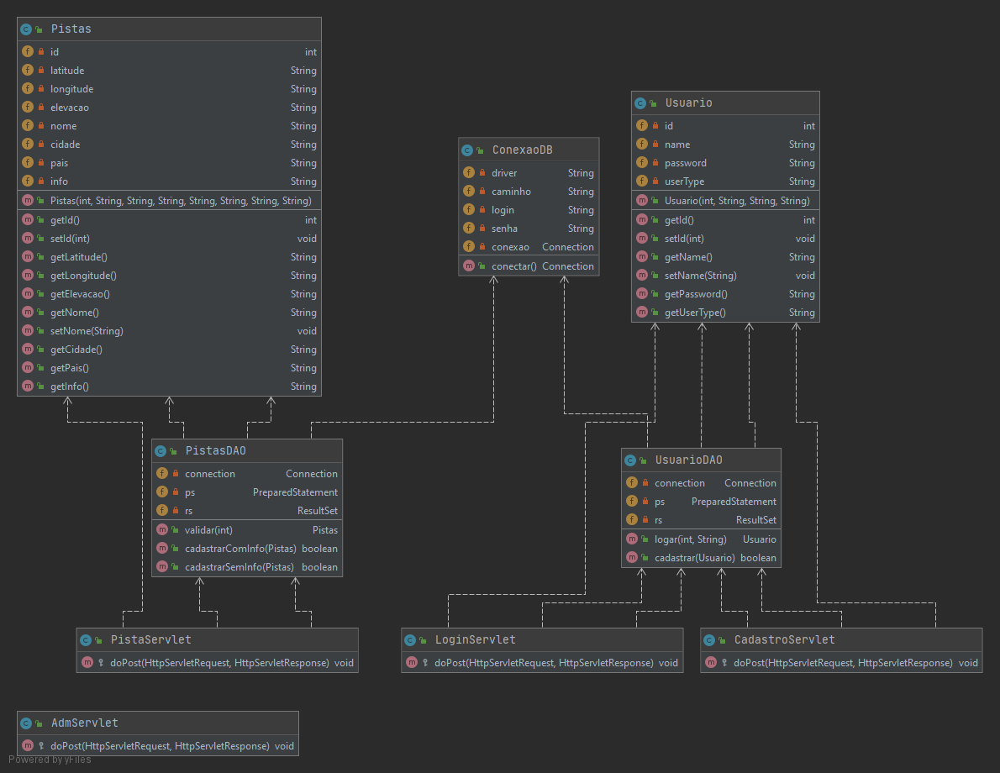

# DSRPT21 - 2SI - Programação Orientada a Objetos

Modelar um sistema Java WEB (Servlet + JSP) que permita ao usuário da aplicação
(usuário administrador) cadastrar as pistas e o seu respectivo destino em uma base de dados
Oracle. 
O sistema deverá ter dois tipos de usuário: administrador e o usuário cliente que irá 
interagir com a aplicação. O usuário administrador da aplicação também é responsável por
cadastrar os usuários clientes.

# Integrantes: 
* Danilo Manchon
  RM:79990

* Jônatas Lima de Medeiros 
  RM:86272

* Lucas Marossi
  RM:80409
